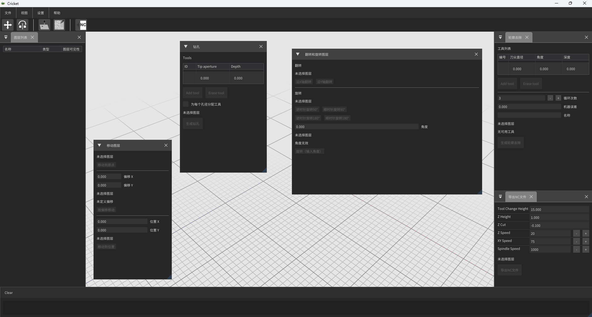

# Cricket 🦗

Cricket is a lightweight and practical CAM application designed to work with PCB files. It currently allows you to generate board outlines, cut cards, and drill holes in PCBs, offering a simple workflow for basic manufacturing tasks.

The project is in constant evolution. Upcoming goals include:
- An integrated Gerber and DRL file editor.
- Advanced visualization tools, such as grids and different view modes.
- A complete undo/redo system for safer and more flexible work.

The idea behind Cricket is to grow as long as it remains useful and practical for the community. In the short term, several additional versions will focus on bug fixes and the addition of the undo/redo system, while exploring new features that make PCB work easier.

---

## 📦 Download & Run
You don’t need to build the project manually.  
A precompiled executable is available for download in the [Releases section](../../releases).

---

## 📸 Preview

### GERBER files

### DRL files

### Contour Generation

### Other operations

---

## Legal Notice
This software is provided "as is," without any kind of warranty, express or implied. The author shall not be held responsible for any damage, data loss, equipment malfunction, or direct or indirect consequences resulting from the use or misuse of this program.
By using this software, the user acknowledges and agrees to the following:
- The software may cause damage to CNC machines, computers, or other devices.
- The author will not be liable for any economic losses, business interruptions, or incidental or consequential damages.
- The user assumes full responsibility for the operation and the results obtained when using this software.
- This software is intended solely for personal and individual use.
- Use by companies, institutions, or for corporate purposes is strictly prohibited.

---

## Terms of Use
- This software is currently offered free of charge. This condition may change at the author's discretion without prior notice.
- Use of this software implies acceptance of these terms and conditions.
- Redistribution, modification, or reverse engineering of this software without the explicit permission of the author is prohibited.
- The author reserves the right to update, modify, or discontinue this software at any time without prior obligation to notify.
- Use by companies or institutions is not permitted under any circumstances.
- Continued use of the software after any changes to the terms implies acceptance of the new conditions.